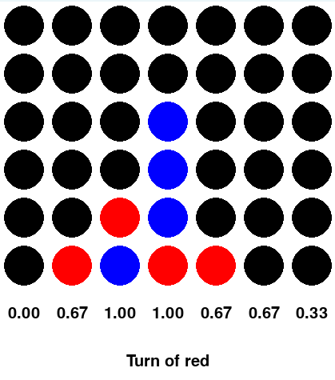

# A0C4
## An implementation of AlphaZero for Connect 4

This project is part of the lecture 
[194.077 Applied Deep Learning](https://tiss.tuwien.ac.at/course/courseDetails.xhtml?courseNr=194077&semester=2023W&dswid=6826&dsrid=998) at the Technical University of Vienna, with Alexander Pacha as main lecturer.
The author of this project is [Joan Salvà Soler](https://linkedin.com/in/jsalvasoler), Data Science Master student. 


The goal of the project is to implement the AlphaZero algorithm for the game of Connect 4 in a 6x7 board. 
DeepMind presented the AlphaZero algorithm in [Silver et. al. (2018)](https://arxiv.org/abs/1712.01815) and is based on the previous work of AlphaGo Zero 
and AlphaGo. DeepMind never released the code for AlphaZero, but many implementations from the community have been published. 
Some references are [Tian et. al. (2022)](https://arxiv.org/abs/1902.04522) or [McGrath et. al. (2021)](https://arxiv.org/abs/2111.09259). However, our work will not use any existing 
implementation, but will just use the architecture details of the paper, along with the insights from the 
implementation attempts. For the DNNs, we will use the PyTorch framework on CPUs. The Monte-Carlo tree search 
will be implemented from scratch, as well as the game of Connect 4. The evaluation of the performance will be 
done by comparing the learned policy with the optimal policy. Finally, a UI will allow a user to play against the 
engine. Rather than being a gaming interface (there are many ways to play C4 online), the goal is to provide
insights into AlphaZero's choices through the visualization of prior probabilities.

### Table of contents
- [Installation](#installation)
- [Configuration file](#configuration-file)
- [Execute](#execute)

### Installation
Clone the repository and make sure that the folder structure is as follows:
```

├── cache
├── models
├── src
│   ├── agents
│   ├── alpha_zero
│   ├── boards
│   ├── testing.py
│   └── utils.py
├── config.yaml
├── README.md
└── requirements.txt
``` 
Then nstall the required packages in your environment using pip: 
```
pip install -r requirements.txt
```

### Configuration file
The configuration file `config.yaml` contains all the parameters of the model. Below is the default configuration:
```yaml
num_iterations: 1     # Number of iterations of the AlphaZero algorithm
num_games: 5          # Number of games to play in each iteration
num_mcts_sims: 10     # Number of MCTS simulations
c_puct: 1             # Exploration parameter
l2_val: 0.0001        # L2 regularization parameter
momentum: 0.9         # Momentum parameter
learning_rate: 0.01   # Learning rate
t_policy_val: 0.0001  # Temperature for the policy
temp_init: 1          # Initial temperature for the policy
temp_final: 0.001     # Final temperature for the policy
temp_thresh: 10       # Threshold for the temperature
epochs: 10            # Number of epochs for the training of the neural networks
batch_size: 128       # Batch size for the training of the neural networks
dirichlet_alpha: 0.5  # Dirichlet parameter
epsilon: 0.25         # Epsilon for the Dirichlet noise
num_eval_games: 10    # Number of games to play for the evaluation
eval_win_rate: 0.55   # Win rate threshold for the evaluation
resnet_blocks: 5      # Number of residual blocks in the ResNet
record_loss: 1        # Whether to record the loss during training
```

### Execute
Depending on the desired action, the following files can be executed:

- The UI can be executed by running the ``boards/ui.py`` file. This allows to play against the selected engine (AlphaZero, Random, Optimal...).
- The training of the neural networks can be executed by running the ``alpha_zero/train.py`` file. This will train the neural networks for the selected number of iterations according to the configuration
- The evaluation of the performance can be executed by running the ``testing.py`` file. This will play the selected number of games against the selected opponent and will print the results.

The UI is implemented in PyGame and looks as follows:



Using it is simple, just click on the column where you want to drop your piece. The UI will then play the move and the engine will play its move.
The numbers below each column are the scores that the engine assigns to each move. The higher the score, the better the move. The move that it was played
will always have the best score. 