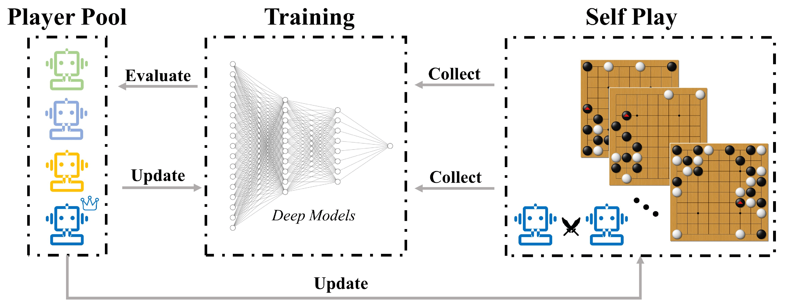
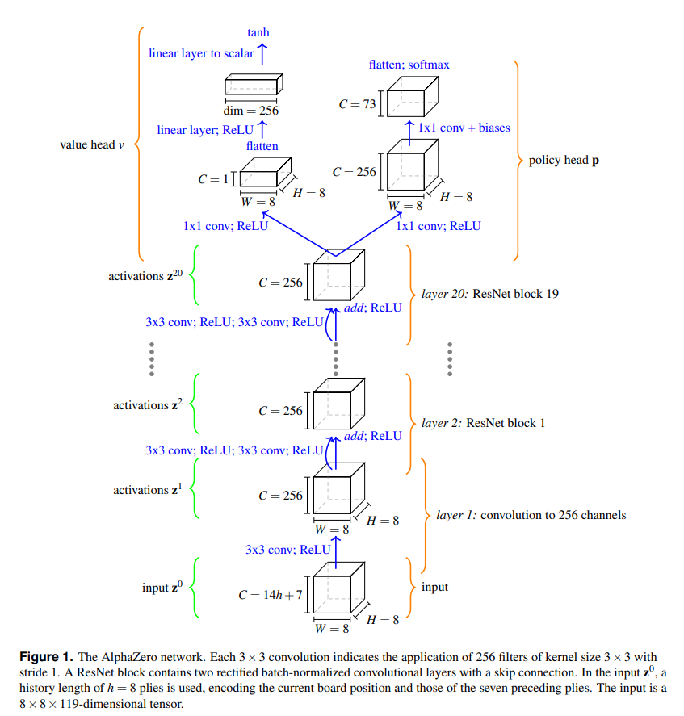

**Applied Deep Learning project: Hacking** 

**Joan Salvà Soler - 12223411**

# A0C4: An implementation of AlphaZero for Connect 4

In this second deliverable of the project, we worked on setting up all the different modules that work together to 
implement the AlphaZero algorithm. In particular, we implement the following classes:
- ``Game`` is an abstract class that implements the Connect 4 game logic.
  - ``ConnectGameBitboard`` is an implementation of ``Game`` that uses a bitboard for efficiency.
- ``TestEnvironment`` is a class that allows to compare the performance of different AI agents by having them play together.
- ``Agent`` is an abstract class that represents an agent that can play Connect 4.
  - ``RandomAgent`` is an implementation of ``Agent`` that plays randomly.
  - ``OptimalAgent`` is an implementation of ``Agent`` that plays optimally.
  - ``AlphaZeroAgent`` is an implementation of ``Agent`` that uses the learned policy and value networks to play.
- ``MCTS`` is a class that implements the Monte Carlo Tree Search algorithm using the learned policy and value networks.
- ``NeuralNetwork`` is a class containing the neural network architecture. ``NNWrapper`` is a wrapper for the NN that allows to 
  train it and to save and load the weights.
- ``Train`` is a class that implements the training loop for the AlphaZero algorithm.
- ``Evaluate`` is a class that implements the evaluation of a neural network inside the training loop of AlphaZero

Let's look at each of these classes in more detail.

## General modules

### Game and ConnectGameBitboard
The ``Game`` class is an abstract class that that could represent any 2 player game with perfect information. I worked on
a first implementation of this class (``ConnectGame``) that uses a 2D array to represent the board. However, this
implementation was not efficient enough to train the neural networks, so I decided to implement a second version of the
game (``ConnectGameBitboard``) that uses a bitboard to represent the board. This implementation is based on 
[this resource](https://github.com/denkspuren/BitboardC4/blob/master/BitboardDesign.md) and [this implementation](
https://github.com/lhorrell99/connect-4-solver/blob/master/board.py). As a result, we get a much more efficient implementation, 
as we can see in the following table:

| Games | ``ConnectGameBitboard`` runtime (s) | ``ConnectGame`` runtime (s) |
|-------|-------------------------------------|-------------------------------------|
| 100   | 0.015                               | 0.514                               |
| 1000  | 0.2                                 | 4.876                               |
| 10000 | 1.536                               | 48.523                              |
| 100000| 14.330                              |                                     |

### TestEnvironment and optimal policy
The ``TestEnvironment`` class allows to compare the performance of different AI agents by having them play together.
The class is initialized with the two agents to compare and the number of games to play. Then, the ``run`` method
runs the games and returns the results.

One challenge that I have already solved is the implementation of the optimal policy. The way I did it is by using
this [online connect4 solver](https://connect4.gamesolver.org/). The solver computes the score of each possible move for a 
given board. The way to pass a board to the solver is by using the sequence of played columns. For example, 
``0402`` means that the first player played in column 0, the second player in column 4, the first player in column 0 again.
Finally, a REQUEST on ``https://connect4.gamesolver.org/?pos=0402=`` returns a dictionary with the scores of each move.
Since it is expensive to make a request for each move, I implemented a cache that stores the results of the requests.

### Agent
The ``Agent`` class is an abstract class that represents an agent that can play Connect 4. It implements the methods to 
retrieve the optimal move for a given board, and for evaluating the accuracy of a move with
respect to the optimal policy.
As explained before, we have three implementations of the ``Agent`` class:
- ``RandomAgent`` is an implementation of ``Agent`` that plays randomly.
- ``OptimalAgent`` is an implementation of ``Agent`` that plays optimally.
- ``AlphaZeroAgent`` is an implementation of ``Agent`` that uses the learned policy and value networks to play.

## AlphaZero architecture
The specific code for the AlphaZero architecture is in the ``src/alpha_zero`` folder. For some context, let's recall the
architecture of AlphaZero:
- A Monte-Carlo Tree Search algorithm performs the tree search. This means that the algorithm will explore the 
  possible moves by simulating games from the current state. The algorithm will then select the move that leads to the 
  best outcome. When a leaf is reached, the whole path is updated with the outcome of the game. This also becomes a 
  training sample for the neural networks.
- Two neural networks are used inside the Monte-Carlo Tree Search algorithm:
  - The policy network is a neural network that takes as input the current state of the game and outputs a probability 
    distribution over the possible moves. The goal of this network is to learn the optimal policy.
  - The value network is a neural network that takes as input the current state of the game and outputs a value between 
    -1 and 1. The goal of this network is to learn the value of the current state.
  - In fact, they are the same neural network, but with different heads.
- The training step iteratively combines a playing phase, where the Monte-Carlo Tree Search explores
positions and gathers a training dataset, and a training phase, where the neural networks are trained on the gathered
dataset. The new neural network is evaluated against the previous versions of it. If there is some improvement, the main NN
is updated neural and will guide the search in the next iteration of the MTCS. This 
is visualized in the following diagram:

- Regarding the Neural Network architecture, we went with the same one as in the original paper. In essence, it comprises
several residual blocks, followed by a policy head and a value head. The policy head is a fully connected layer with
a softmax activation function. The value head is a fully connected layer with a tanh activation function. The number of
residual blocks is a hyperparameter that we will tune later. The following diagram shows the architecture, but keep in mind
that is Chess and not Connect 4:

### MCTS
The ``MCTS`` class implements the Monte Carlo Tree Search algorithm using the learned policy and value networks. The
algorithm is implemented in the ``search`` method. The algorithm is initialized with the current state of the game, and
then it performs a number of iterations. In each iteration, the algorithm performs a tree search, and then updates the
tree with the outcome of the game. The tree search is implemented in the ``tree_search`` method. The algorithm starts
from the root node, and then it iteratively selects the best child node until it reaches a leaf node. The selection of
the best child node is done by using the PUCT formula. Once a leaf node is reached, the algorithm expands the node by
adding all the possible child nodes. Then, the algorithm performs a rollout from the leaf node. The rollout is done by
using the policy network to select the next move. The rollout is done until the end of the game, and then the outcome
of the game is backpropagated to the root node. The backpropagation is done by updating the visit count and the value
of each node in the path. The algorithm returns the root node, which contains the visit counts and values of all the
nodes in the tree. For the implementation, good references were [this blog post](https://web.stanford.edu/~surag/posts/alphazero.html),
[this other blog post and github repo](https://joshvarty.github.io/AlphaZero/), and this [github repo](https://github.com/blanyal/alpha-zero/tree/master).

### NeuralNetwork and NNWrapper
The ``NeuralNetwork`` class contains the neural network architecture. The architecture is the same as in the original
AlphaZero paper. The class implements the forward pass of the network, and the loss function. The loss function is the
sum of the cross-entropy loss of the policy head and the mean squared error of the value head. The class also implements
the ``save`` and ``load`` methods to save and load the weights of the network.
It was implemented in PyTorch.

The ``NNWrapper`` class is a wrapper for the NN that allows to train it and to save and load the weights. The training
is done by using the ``train`` method, which takes as input the training dataset and the number of epochs. The training
dataset is a list of tuples, where each tuple contains the state of the game, the policy vector, and the value. The
training is done by using the Adam optimizer with a learning rate of 0.001. The weights are saved and loaded by using
the ``save`` and ``load`` methods, which take as input the path to the file where the weights are saved.

### Train
The ``Train`` class implements the main training loop:

For a number of iterations:
 - Play a number of games by using the current neural network and the MCTS algorithm.
 - Update MCTS tree with the results of the games.
 - Gather training dataset from the MCTS tree.
 - Train the neural network on the gathered dataset.
 - Evaluate the new neural network against the previous versions of it.
 - If there is some improvement, update the main NN and save it.

## Results and project status
#### Performance measures
The fact that Connect 4 is solved means that we can compare the performance of our agents with the optimal policy.
We define the following accuracy metric for a move: 
- Assume _optimal_eval_ is the optimal evaluation of the move, i.e. the score of the move according to the optimal policy.
Note that this is a number between -22 and 22 because it represents the minimum number of moves to win if played optimally.
- Assume _x_ is the evaluation of the move (_optimal_eval_[_move_]).
- Then the accuracy of the move is (_x_ + 22) / (max(_evaluations_) + 22)
- We define the accuracy of an agent in a game as the average of the single move accuracies.

#### Results
- We experiment with this measure for the RandomAgent, which should give a baseline for us to beat.
After playing 100 random games against itself (random vs random) and against the optimal policy, 
we could conclude that the RandomAgent has an average accuracy of **0.81**. It could seem high, but it is not, it just has to do 
with the scaling of the _evaluation_ vector and the choice of the accuracy metric.
- We also experiment with this measure for the OptimalAgent and indeed has an accuracy of **1.0**.

What would be the target accuracy for the AlphaZeroAgent? We would naturally expect it to be better than the
RandomAgent, i.e., > 0.81. But how good do we aim for? We could aim for 1.0, but that is unlikely to happen. However, 
I could imagine that if AlphaZero is trained in the same settings as it was done by DeepMind for Chess or Go 
(that is 5000 TPUs during 3 days), it would be able to learn the optimal policy. However, our hardware limitations will
make things difficult, and we will have to settle for a lower accuracy. We want to set a target number; we simply aim for 
the highest accuracy possible!

#### Last experiments and project status
The training loop of AlphaZero is expensive. The main bottleneck is the Neural Network forward pass, which is used in
the MCTS algorithm for every node expansion and search. Therefore, the training executions that I have done so far have
been limited to 30 minutes of training. The best accuracy that I have achieved so far is **0.875**. It seems to be 
significantly better than the baseline accuracy. In a series of 20 games against the RandomAgent, AlphaZero won 17/20 games. 
However, it is still far from the optimal policy. More and longer training is needed to achieve better results. Hyperparameter
tuning could also help to improve the results, and only minor parameters have been tuned so far.

#### Areas to improvement and next steps
1. **game-free evaluation**: The idea would be to evaluate all Agents on the same set of benchmark positions, and then
   compare the results.
2. **simpler architectures**: We use a replica of the Neural Network used in the original AlphaZero paper, which was 
designed for Chess and Go. We could try to simplify the architecture to make it more suitable for Connect 4. For example,
reducing the number of residual blocks (currently 5), or reducing the number of filters in each convolutional 
layer (currently 256). This could result in a significant speedup, which would allow us to train the network for more
epochs.
3. **in-depth analysis of the learned policy**: We could analyze the learned policy to see if it makes sense. For example,
we could look at the policy for a given board and see the prior probabilities of the different moves. This next step goes in the 
direction of the next deliverable, which consists in building a web app that allows to play against the AlphaZero agent while 
visualizing the learned policy. 

#### Work breakdown
|Task | Description                     | Estimated hours | Actual hours |
|-----|---------------------------------|-----------------|--------------|
|Task 1| Implement Connect 4 game logic  | 5 | 5            |
|Task 2| Research AlphaZero architecture | 5 | 9            |
|Task 3| Implement AlphaZero architecture| 15 | 25           |
|Task 4| Implement evaluation module    | 5 | 4            |
|Task 5| Training, hyperparameter tuning, and evaluation | 10 | 10*          |
|Task 6| Streamlit or PyGame application | 15 | 0*           |
|Task 7| Preparation of the presentation | 5 | 0*           |

*Still to be worked on in the next deliverable.

Overall, I estimated 40 hours of work for this deliverable, and I have worked 53 hours. I still want to 
improve a couple of things that would fall into this deliverable, which means the overall time spent on this deliverable
will be around 60 hours (+50% of the estimated time). 

I am happy with the progress so far, and I am learning a lot. I am also satisfied with the preliminary results, which I find 
promising. I am looking forward to the next deliverable, where I will work on the web app and on the final presentation.

